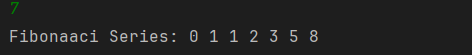

# Fibonacci Series

A beginner-friendly Java program that prints the **Fibonacci series** using a `while` loop.  
It helps beginners understand **looping concepts** and **sequence generation** in Java.

---

## Features
- Demonstrates the use of a `while` loop  
- Prints the Fibonacci series up to the number of terms entered by the user  
- Beginner-friendly and easy to understand  

---

## How to Run
1. Open the project in any Java IDE (IntelliJ, Eclipse, VS Code).  
2. Compile the program file `Main.java`.  
3. Run the program.  
4. Enter the number of terms you want in the Fibonacci sequence.  
5. The program will display the Fibonacci series in the console.  

---

## Screenshot



---

## Author
- **Yash Shukla**  
- GitHub: [yashshukla04](https://github.com/yashshukla04)  
- Email: yash454shukla@gmail.com  
```

Do you want me to generate this as a **README.md file** that you can directly add to your project folder?

