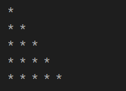

# Star Pattern

A beginner-friendly Java program that prints a right-angled triangle star pattern using nested `while` loops.  
It helps beginners understand **looping concepts** in Java.

---

## Features
- Demonstrates the use of nested `while` loops  
- Prints a clean star pattern in the console  
- Beginner-friendly and easy to understand  

---

## How to Run
1. Open the project in any Java IDE (IntelliJ, Eclipse, VS Code).  
2. Compile the program file `Main.java`.  
3. Run the program.  
4. The program will display the star pattern in the console.  

---

## Screenshot

---

## Author
- **Yash Shukla**  
- GitHub: [yashshukla04](https://github.com/yashshukla04)  
- Email: yash454shukla@gmail.com  
